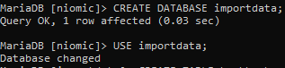
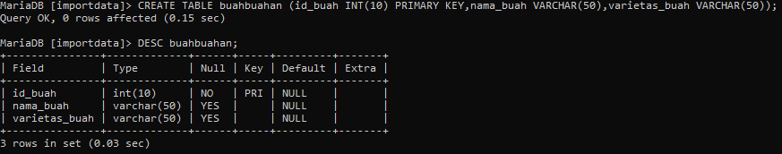
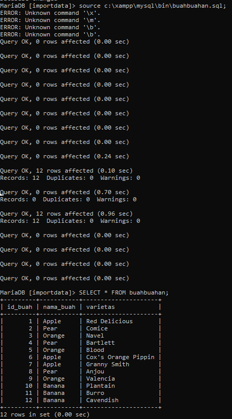

# Tugas_10_MySQL

### 1. Buat database **importdata**
```mysql
CREATE DATABASE importdata;
```

```mysql
USE importdata;
```



### 2. Buat table buahbuahan dengan ketentuan seperti berikut:
###   - Terdapat kolom id_buah int(10) primary key, nama_buah varchar (50) dan varietas_buah varchar(50)
```mysql
CREATE TABLE buahbuahan (
	id_buah INT(10) PRIMARY KEY,
	nama_buah VARCHAR(50),
	varietas_buah VARCHAR(50)
);
```



### 3. Import data dari file sql ke dalam table buahbuahan: https://drive.google.com/file/d/1_lFGNXXiwakapzE44Exv-BfEXxokb8GS/view?usp=sharing
```mysql
source c:\xampp\mysql\bin\buahbuahan.sql;
```


